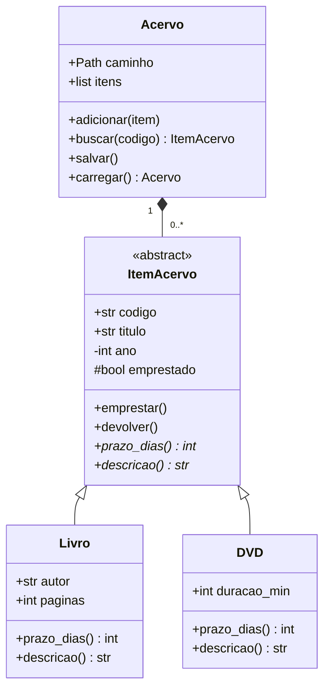

# Programação Orientada a Objetos em Python

### Apostila de estudos — 60h (80 h/a) · 4 créditos

**Curso:** Tecnologia em Sistemas para Internet
**Disciplina:** Programação Orientada a Objetos
**Pré-requisito:** Introdução à Lógica e Programação
**Linguagem adotada nesta apostila:** Python 3.10+

> **Nota sobre a linguagem.** O plano de curso traz bibliografia em Java. Esta apostila cobre **exatamente os mesmos conteúdos da ementa**, porém com exemplos em Python. Os conceitos de POO são os mesmos em qualquer linguagem — muda a sintaxe. Onde há uma diferença importante entre Java e Python, há um box **"Se você viu em Java…"** explicando.

---

## Como usar esta apostila

1. Leia a teoria de cada seção.
2. **Digite** os exemplos (não copie e cole — digitar fixa muito mais).
3. Rode os arquivos prontos da pasta `codigo/`.
4. Faça os exercícios do fim de cada capítulo antes de avançar.

**Arquivos que acompanham a apostila:**

```
poo-python/
├── APOSTILA_POO_Python.md          ← este arquivo
└── codigo/
    ├── cap01_fundamentos.py         Capítulo 1 completo, executável
    ├── cap03_excecoes.py            Capítulo 3 completo, executável
    ├── cap04_pacotes/               Capítulo 4 (estrutura de pacotes)
    │   ├── main.py
    │   └── loja/…
    ├── cap05_serializacao.py        Capítulo 5 completo, executável
    ├── cap06_gui.py                 Capítulo 6 (agenda com Tkinter)
    └── projeto_biblioteca/          Projeto integrador (os 6 tópicos)
        ├── main.py
        └── biblioteca/…
```

Para rodar qualquer um: abra o terminal na pasta do arquivo e digite `python3 nome_do_arquivo.py`.

---

## Sumário

| Cap. | Conteúdo | Item da ementa |
|-----|----------|----------------|
| 0 | Por que POO? Do procedural ao orientado a objetos | introdução |
| 1 | Fundamentos de POO | 1.1 a 1.7 |
| 2 | Modelagem com UML — diagrama de classes | 2.1 |
| 3 | Tratamento de exceções | 3 |
| 4 | Modularização e pacotes (namespaces) | 4 |
| 5 | Serialização e persistência | 5.1 e 5.2 |
| 6 | Interface gráfica do usuário (GUI) | 6 |
| 7 | Projeto integrador: Sistema de Biblioteca | todos |
| A | Glossário, erros comuns e bibliografia | — |

---
---

# Capítulo 0 — Por que POO?

## 0.1 O problema do código procedural

Imagine um sistema de conta bancária escrito do jeito que você aprendeu em Lógica de Programação:

```python
# Estilo procedural: dados soltos + funções soltas
saldo_ana = 1000.0
saldo_bruno = 500.0

def sacar(saldo, valor):
    return saldo - valor

saldo_ana = sacar(saldo_ana, 200)
```

Funciona com 2 contas. Agora imagine **5 mil contas**, cada uma com titular, CPF, agência, histórico de transações e limite. Você teria dezenas de listas paralelas e funções que recebem 8 parâmetros. Pior: nada impede alguém escrever `saldo_ana = -99999`.

Três problemas aparecem:

| Problema | O que acontece |
|---|---|
| **Dados espalhados** | As informações de uma mesma coisa ficam em variáveis separadas |
| **Sem proteção** | Qualquer parte do programa pode corromper os dados |
| **Repetição** | Copiar e colar código parecido para casos parecidos |

## 0.2 A ideia central da POO

> **Orientação a objetos é juntar, numa mesma unidade, os DADOS e as OPERAÇÕES que agem sobre esses dados.**

Essa unidade é o **objeto**. Em vez de "um saldo aqui e uma função sacar() ali", você tem uma **conta** que *sabe o próprio saldo* e *sabe sacar de si mesma*:

```python
conta_ana = ContaBancaria("Ana", 1000.0)
conta_ana.sacar(200)          # a conta cuida de si mesma
print(conta_ana.saldo)        # 800.0
```

O programa passa a ser um conjunto de objetos que **conversam entre si** trocando mensagens (chamadas de método) — parecido com o mundo real, onde um carro tem um motor, um cliente faz um pedido, um pedido tem itens.

## 0.3 Os quatro pilares

Você vai ver cada um em detalhe no Capítulo 1. Guarde os nomes:

| Pilar | Em uma frase |
|---|---|
| **Abstração** | Representar no código só o que importa do mundo real |
| **Encapsulamento** | Esconder o funcionamento interno e proteger os dados |
| **Herança** | Criar classes novas aproveitando classes existentes |
| **Polimorfismo** | O mesmo comando funcionar de formas diferentes em objetos diferentes |

---
---

# Capítulo 1 — Fundamentos de POO

> Código completo e executável: `codigo/cap01_fundamentos.py`

## 1.1 Abstração

**Abstrair** = olhar para algo do mundo real e escolher **só o que interessa** para o seu sistema, ignorando o resto.

Um aluno de verdade tem altura, cor dos olhos, time de futebol, nome da mãe, tipo sanguíneo… Mas num **sistema acadêmico**, o que importa?

```
Aluno (no sistema acadêmico)
  ├── matrícula      ✔ importa
  ├── nome           ✔ importa
  ├── notas          ✔ importa
  ├── altura         ✘ não importa
  └── time de futebol ✘ não importa
```

Num sistema de **plano de saúde**, altura e tipo sanguíneo passariam a importar, e as notas não. **A abstração depende do contexto** — não existe "a" modelagem certa, existe a modelagem adequada ao problema.

> **Regra prática:** antes de escrever a classe, pergunte "quais informações e quais ações esse elemento precisa ter *para o meu sistema funcionar*?"

## 1.2 Classes, objetos, atributos e métodos

### A analogia da forma de bolo

| Conceito | Analogia | No código |
|---|---|---|
| **Classe** | A forma / o molde | `class Cachorro:` |
| **Objeto** | O bolo que sai da forma | `rex = Cachorro(...)` |
| **Atributo** | Sabor, cobertura do bolo | `self.nome`, `self.raca` |
| **Método** | O que o bolo "faz" (ser servido, ser cortado) | `def latir(self):` |

A classe é escrita **uma vez**; dela você cria **quantos objetos quiser**, cada um com seus próprios valores.

### Escrevendo a primeira classe

```python
class Cachorro:
    """Molde (classe) para criar cachorros (objetos)."""

    def __init__(self, nome, raca, idade):
        self.nome = nome      # atributo de instância
        self.raca = raca
        self.idade = idade

    def latir(self):
        return f"{self.nome} diz: Au au!"

    def fazer_aniversario(self):
        self.idade += 1
        return f"{self.nome} agora tem {self.idade} anos."
```

Usando:

```python
rex = Cachorro("Rex", "Labrador", 3)
mel = Cachorro("Mel", "Poodle", 5)

print(rex.latir())               # Rex diz: Au au!
print(mel.latir())               # Mel diz: Au au!
print(rex.fazer_aniversario())   # Rex agora tem 4 anos.
```

Repare: `rex` e `mel` vieram da mesma classe, mas têm **valores próprios**. Mudar a idade de `rex` não afeta `mel`.

### As duas coisas que mais confundem no início

**1. O que é `__init__`?**

É o **construtor**: um método especial que o Python chama **automaticamente** quando você cria o objeto. Ele serve para dar os valores iniciais aos atributos. Você nunca chama `__init__` na mão — quem chama é o `Cachorro(...)`.

**2. O que é `self`?**

`self` é o **próprio objeto**. Quando você escreve `rex.latir()`, o Python traduz internamente para `Cachorro.latir(rex)` — ou seja, `self` vira `rex`.

```python
rex.latir()          # você escreve isso
Cachorro.latir(rex)  # o Python faz isso   →  self = rex
```

Por isso `self` é sempre o **primeiro parâmetro** de todo método, e por isso `self.nome` significa "o nome *deste* objeto aqui".

> ⚠️ **Erro clássico de iniciante:** esquecer o `self`.
> ```python
> def latir():                    # ERRO: TypeError ... takes 0 positional arguments
>     return "Au au"
> ```

### Atributo de instância × atributo de classe

```python
class Cachorro:
    especie = "Canis familiaris"      # ATRIBUTO DE CLASSE: igual para todos
    total = 0                          # compartilhado

    def __init__(self, nome):
        self.nome = nome               # ATRIBUTO DE INSTÂNCIA: um por objeto
        Cachorro.total += 1

rex = Cachorro("Rex")
mel = Cachorro("Mel")
print(rex.especie, mel.especie)   # Canis familiaris Canis familiaris
print(Cachorro.total)             # 2
```

### Métodos especiais (dunder methods)

Métodos com dois underscores dos dois lados têm significado especial. Os dois mais úteis agora:

```python
class Ponto:
    def __init__(self, x, y):
        self.x, self.y = x, y

    def __str__(self):        # texto amigável, usado pelo print()
        return f"({self.x}, {self.y})"

    def __repr__(self):       # texto técnico, usado no terminal/depuração
        return f"Ponto(x={self.x}, y={self.y})"

p = Ponto(3, 4)
print(p)        # (3, 4)          ← usa __str__
p               # Ponto(x=3, y=4) ← usa __repr__ no terminal interativo
```

Sem `__str__`, o `print(p)` mostraria algo inútil como `<__main__.Ponto object at 0x7f8b...>`.

> **Se você viu em Java…** `__init__` é o construtor (`public Cachorro(...)`), `self` é o `this`, e `__str__` é o `toString()`. Diferença: em Python o `this`/`self` é **explícito** — você precisa escrevê-lo.

## 1.3 Estado e comportamento

Todo objeto tem duas dimensões:

- **Estado** = os *valores atuais* dos atributos. Responde a *"como o objeto está agora?"*
- **Comportamento** = os métodos. Responde a *"o que o objeto sabe fazer?"*

```python
class ContaBancaria:
    def __init__(self, titular, saldo=0.0):
        self.titular = titular
        self.saldo = saldo          # ESTADO

    def depositar(self, valor):     # COMPORTAMENTO
        self.saldo += valor

    def sacar(self, valor):
        if valor > self.saldo:
            return False
        self.saldo -= valor
        return True
```

O ponto-chave: **o comportamento altera o estado**.

```python
c = ContaBancaria("Ana", 100.0)
# estado agora: saldo = 100.0
c.depositar(50)
# estado agora: saldo = 150.0   ← o método mudou o estado
```

Dois objetos da mesma classe podem estar em **estados diferentes** e, por isso, reagir de forma diferente ao mesmo comando:

```python
rica = ContaBancaria("Ana", 10_000)
pobre = ContaBancaria("Bruno", 10)

rica.sacar(500)    # True
pobre.sacar(500)   # False   ← mesmo método, resultado diferente por causa do estado
```

## 1.4 Encapsulamento

**Encapsular** = esconder os detalhes internos e obrigar o mundo externo a passar pelos métodos que você controla.

### O problema

```python
conta = ContaBancaria("Ana", 100)
conta.saldo = -50_000        # 😱 ninguém impediu!
```

Se o atributo é público, **qualquer linha do programa** pode colocá-lo num estado inválido. Aí, quando aparecer um saldo negativo, você não vai saber quem fez.

### Os níveis de acesso em Python

| Escrita | Nome | Significado |
|---|---|---|
| `self.saldo` | público | Livre para todos |
| `self._saldo` | protegido (convenção) | "Use só dentro da classe/subclasses" — o Python não impede, é um acordo entre programadores |
| `self.__saldo` | privado (*name mangling*) | O Python renomeia para `_Classe__saldo`, dificultando o acesso de fora |

### A solução: atributo privado + métodos de acesso

```python
class ContaSegura:
    def __init__(self, titular, saldo_inicial=0.0):
        self.titular = titular
        self.__saldo = saldo_inicial     # privado

    @property
    def saldo(self):
        """Getter: leitura liberada, escrita não."""
        return self.__saldo

    def depositar(self, valor):
        if valor <= 0:
            raise ValueError("Depósito deve ser positivo.")
        self.__saldo += valor

    def sacar(self, valor):
        if valor <= 0:
            raise ValueError("Saque deve ser positivo.")
        if valor > self.__saldo:
            raise ValueError("Saldo insuficiente.")
        self.__saldo -= valor
```

```python
c = ContaSegura("Ana", 200)
print(c.saldo)     # 200   ← lê normalmente, parece um atributo
c.saldo = 99999    # AttributeError: property 'saldo' has no setter
c.sacar(9999)      # ValueError: Saldo insuficiente.
```

O `@property` faz o método `saldo()` ser usado **como se fosse um atributo** (sem parênteses). É a forma pythônica de fazer *getter*.

### Setter com validação

Quando a escrita precisa ser permitida, mas **validada**:

```python
class Produto:
    def __init__(self, nome, preco):
        self.nome = nome
        self.preco = preco          # atenção: já passa pelo setter!

    @property
    def preco(self):
        return self.__preco

    @preco.setter
    def preco(self, valor):
        if valor < 0:
            raise ValueError("Preço não pode ser negativo.")
        self.__preco = valor
```

```python
p = Produto("Caneta", 3.50)
p.preco = 4.00       # ok, passou pela validação
p.preco = -10        # ValueError: Preço não pode ser negativo.
```

> **Se você viu em Java…** Java usa `private double saldo;` + `getSaldo()`/`setSaldo()`. Python prefere deixar público e só criar `@property` **quando existe validação de verdade**. Não crie getter/setter vazio para tudo — isso é "Java com sotaque", não Python.

## 1.5 Composição

**Composição** = um objeto **TEM-UM** outro objeto como atributo.

```python
class Motor:
    def __init__(self, potencia_cv):
        self.potencia_cv = potencia_cv
        self.ligado = False

    def ligar(self):
        self.ligado = True
        return f"Motor de {self.potencia_cv}cv ligado."


class Carro:
    def __init__(self, modelo, potencia_cv):
        self.modelo = modelo
        self.motor = Motor(potencia_cv)   # o Carro TEM-UM Motor

    def ligar(self):
        return f"{self.modelo}: {self.motor.ligar()}"   # delega ao motor
```

```python
print(Carro("Fusca", 65).ligar())   # Fusca: Motor de 65cv ligado.
```

O `Carro` não sabe *como* o motor liga — ele **delega** a tarefa. Isso divide o problema em peças menores e independentes.

### Composição × Agregação

Ambas são relações "TEM-UM", mas o **ciclo de vida** difere:

| Relação | Regra | Exemplo |
|---|---|---|
| **Composição** | A parte **não existe** sem o todo. Se o todo morre, a parte morre. | Um `Pedido` e seus `ItemPedido`; uma `Casa` e seus `Cômodos` |
| **Agregação** | A parte **existe independente** do todo | Uma `Turma` e seus `Alunos` (o aluno continua existindo se a turma acabar) |

```python
# COMPOSIÇÃO: o Pedido cria seus próprios itens
class Pedido:
    def __init__(self):
        self.itens = []
    def adicionar_item(self, produto, qtd):
        self.itens.append(ItemPedido(produto, qtd))   # criado aqui dentro

# AGREGAÇÃO: a Turma recebe alunos que já existem
class Turma:
    def __init__(self, nome):
        self.nome = nome
        self.alunos = []
    def matricular(self, aluno):        # o aluno vem de fora, pronto
        self.alunos.append(aluno)
```

## 1.6 Herança e Polimorfismo

### Herança: a relação É-UM

**Herança** = criar uma classe nova a partir de uma existente, aproveitando tudo que ela já tem.

```
        Animal          ← superclasse / classe-mãe / classe-base
       /      \
    Gato      Vaca      ← subclasses / classes-filhas / derivadas
```

O teste é a frase **"É-UM"**: *um Gato **é um** Animal* ✔ · *um Carro **é um** Motor* ✘ (isso é composição!).

```python
class Animal:
    def __init__(self, nome):
        self.nome = nome

    def emitir_som(self):
        return "..."

    def apresentar(self):
        return f"{self.nome} faz: {self.emitir_som()}"


class Gato(Animal):                 # Gato herda de Animal
    def emitir_som(self):           # SOBRESCRITA (override)
        return "Miau"


class Vaca(Animal):
    def emitir_som(self):
        return "Muuu"
```

```python
Gato("Frajola").apresentar()   # 'Frajola faz: Miau'
Vaca("Mimosa").apresentar()    # 'Mimosa faz: Muuu'
```

O `Gato` **não precisou** escrever `__init__` nem `apresentar()` — herdou os dois. Só reescreveu o que muda.

### `super()`: chamando o pai

Quando a filha precisa **acrescentar** algo ao que o pai já faz:

```python
class Funcionario:
    def __init__(self, nome, salario_base):
        self.nome = nome
        self.salario_base = salario_base

    def calcular_salario(self):
        return self.salario_base

    def __str__(self):
        return f"{self.nome}: R$ {self.calcular_salario():.2f}"


class Vendedor(Funcionario):
    def __init__(self, nome, salario_base, total_vendas):
        super().__init__(nome, salario_base)    # reaproveita o __init__ do pai
        self.total_vendas = total_vendas        # e acrescenta o que é seu

    def calcular_salario(self):
        return self.salario_base + self.total_vendas * 0.05
```

```python
print(Funcionario("Carlos", 2000))          # Carlos: R$ 2000.00
print(Vendedor("Diana", 1500, 20000))       # Diana: R$ 2500.00
```

### Polimorfismo: muitas formas

**Polimorfismo** = o **mesmo comando** produz **comportamentos diferentes**, dependendo do tipo do objeto.

```python
folha = [Funcionario("Carlos", 2000), Vendedor("Diana", 1500, 20000)]

for f in folha:
    print(f.calcular_salario())    # mesma chamada, cálculos diferentes
```

Repare no poder disso: o laço **não sabe nem precisa saber** se cada item é `Funcionario` ou `Vendedor`. Se amanhã surgir uma classe `Gerente`, o laço continua funcionando **sem nenhuma alteração**. Isso é o que torna sistemas orientados a objetos fáceis de estender.

### Duck typing: o polimorfismo pythônico

> *"Se anda como um pato e grasna como um pato, então é um pato."*

Python não exige herança para haver polimorfismo. Basta o objeto **ter o método**:

```python
class Pato:
    def falar(self): return "Quack"

class Robo:                          # não herda de nada
    def falar(self): return "Bip bop"

for x in [Pato(), Robo()]:
    print(x.falar())                 # funciona: os dois têm .falar()
```

> **Se você viu em Java…** Em Java, para tratar objetos uniformemente, eles precisam compartilhar uma superclasse ou interface. Em Python, basta terem os mesmos métodos.

## 1.7 Classes abstratas e Interfaces

### O problema

Faz sentido criar um `Animal` "puro"? Um `FormaGeometrica` genérica, sem forma? Não. Essas classes existem apenas para **definir um contrato** que as filhas devem cumprir.

### Classe abstrata com `ABC`

Uma **classe abstrata** não pode ser instanciada e pode conter **métodos abstratos** (sem implementação) que as filhas são **obrigadas** a implementar.

```python
from abc import ABC, abstractmethod
import math


class FormaGeometrica(ABC):
    @abstractmethod
    def area(self): ...

    @abstractmethod
    def perimetro(self): ...

    def descrever(self):                      # método CONCRETO, já pronto
        return (f"{self.__class__.__name__}: "
                f"área={self.area():.2f}, perímetro={self.perimetro():.2f}")


class Retangulo(FormaGeometrica):
    def __init__(self, base, altura):
        self.base, self.altura = base, altura

    def area(self):       return self.base * self.altura
    def perimetro(self):  return 2 * (self.base + self.altura)


class Circulo(FormaGeometrica):
    def __init__(self, raio):
        self.raio = raio

    def area(self):       return math.pi * self.raio ** 2
    def perimetro(self):  return 2 * math.pi * self.raio
```

```python
for forma in [Retangulo(3, 4), Circulo(5)]:
    print(forma.descrever())
# Retangulo: área=12.00, perímetro=14.00
# Circulo: área=78.54, perímetro=31.42

FormaGeometrica()
# TypeError: Can't instantiate abstract class FormaGeometrica
#            without an implementation for abstract methods 'area', 'perimetro'
```

Dois ganhos:
1. **Garantia**: é impossível criar uma forma que não saiba calcular área — o erro aparece na hora, não em produção.
2. **Reúso**: `descrever()` foi escrito uma vez e funciona para todas as filhas.

### Interfaces

Uma **interface** é um contrato **100% abstrato**: só assinaturas de métodos, nenhuma implementação. Python não tem a palavra-chave `interface`; usa-se uma `ABC` só com métodos abstratos.

```python
class Imprimivel(ABC):
    @abstractmethod
    def imprimir(self): ...

class Exportavel(ABC):
    @abstractmethod
    def exportar_csv(self): ...


class Relatorio(Imprimivel, Exportavel):     # implementa DUAS interfaces
    def __init__(self, titulo, linhas):
        self.titulo, self.linhas = titulo, linhas

    def imprimir(self):
        return f"=== {self.titulo} ===\n" + "\n".join(self.linhas)

    def exportar_csv(self):
        return "\n".join(self.linhas)
```

### Classe abstrata × Interface

| | Classe abstrata | Interface |
|---|---|---|
| Tem código pronto? | Sim, pode ter métodos concretos | Não, só assinaturas |
| Tem atributos? | Sim | Não (normalmente) |
| Relação | "É-UM" | "É CAPAZ DE" |
| Quantas herdar? | Em Java, 1. Em Python, várias | Várias |
| Use quando… | há código comum a compartilhar | só quer garantir um contrato |

> **Se você viu em Java…** Java separa `abstract class` de `interface` na sintaxe. Python usa `ABC` para os dois casos e permite herança múltipla, então a diferença é de **intenção**, não de sintaxe.

---

## Exercícios do Capítulo 1

1. **(Abstração)** Liste 5 atributos e 3 métodos relevantes para a classe `Aluno` num sistema de biblioteca escolar. Justifique por que descartou 3 características do mundo real.
2. **(Classes)** Crie a classe `Retangulo` com `base`, `altura`, e métodos `area()`, `perimetro()` e `eh_quadrado()`.
3. **(Encapsulamento)** Crie `Termometro` com `__celsius` privado, uma `@property celsius` com setter que rejeita valores abaixo de −273.15, e uma `@property fahrenheit` **somente leitura** que converte.
4. **(Composição)** Modele `Pedido` composto por vários `ItemPedido` (cada um com produto, preço e quantidade). `Pedido.total()` soma tudo.
5. **(Herança)** Crie `Veiculo` (marca, modelo, rodas) e as filhas `Carro`, `Moto` e `Caminhao`, cada uma com `descricao()` própria.
6. **(Polimorfismo)** Crie uma lista com um objeto de cada classe do exercício 5 e percorra chamando `descricao()`.
7. **(Abstrata)** Transforme `Veiculo` em classe abstrata com `calcular_ipva()` abstrato: carro 4% do valor, moto 2%, caminhão isento (0).

---
---

# Capítulo 2 — Modelagem com UML

> **UML** (*Unified Modeling Language*) é a linguagem-padrão para **desenhar** software antes de programá-lo. É o "projeto arquitetônico" do sistema — você não constrói uma casa sem planta.

## 2.1 Diagrama de classes

É o diagrama mais usado da UML. Mostra as **classes**, seus **atributos**, seus **métodos** e como elas se **relacionam**.

### Anatomia de uma classe em UML

Um retângulo com três compartimentos:

```
┌─────────────────────────────┐
│         ContaSegura         │  ← 1) NOME da classe
├─────────────────────────────┤
│ - titular : str             │  ← 2) ATRIBUTOS
│ - saldo : float             │
├─────────────────────────────┤
│ + depositar(valor) : void   │  ← 3) MÉTODOS (operações)
│ + sacar(valor) : void       │
│ + get_saldo() : float       │
└─────────────────────────────┘
```

### Visibilidade

| Símbolo | Significado | Em Python |
|:---:|---|---|
| `+` | público | `self.nome` |
| `-` | privado | `self.__nome` |
| `#` | protegido | `self._nome` |

Convenções: nome de classe em **negrito**; classe ou método **abstrato** em *itálico* (ou com `{abstract}`); atributo/método **estático** sublinhado.

### Os relacionamentos

```
Herança (É-UM)             Composição (TEM-UM forte)
  Gato ──────▷ Animal        Pedido ◆────── ItemPedido
  (triângulo vazio           (losango PREENCHIDO no todo;
   apontando para o pai)      item não existe sem o pedido)

Agregação (TEM-UM fraco)   Associação (usa/conhece)
  Turma ◇────── Aluno        Cliente ─────── Pedido
  (losango VAZIO;            (linha simples)
   aluno existe sozinho)

Realização (implementa interface)     Dependência (usa temporariamente)
  Relatorio ┈┈┈┈▷ Imprimivel           Relatorio ┈┈┈> Impressora
  (linha tracejada + triângulo vazio)  (linha tracejada + seta aberta)
```

### Multiplicidade (cardinalidade)

Escrita nas pontas da linha, diz **quantos** objetos participam:

| Notação | Leitura |
|---|---|
| `1` | exatamente um |
| `0..1` | zero ou um (opcional) |
| `*` ou `0..*` | zero ou muitos |
| `1..*` | um ou muitos |
| `2..5` | de dois a cinco |

```
Pedido ◆────────────── ItemPedido
       1            1..*

Lê-se: "um Pedido é composto por um ou muitos ItemPedido,
        e cada ItemPedido pertence a exatamente um Pedido".
```

## 2.2 Exemplo completo: o Sistema de Biblioteca

Este é o diagrama do projeto do Capítulo 7:

```
                    ┌───────────────────────────────┐
                    │      «abstract» ItemAcervo    │
                    ├───────────────────────────────┤
                    │ + codigo : str                │
                    │ + titulo : str                │
                    │ - ano : int                   │
                    │ # emprestado : bool           │
                    ├───────────────────────────────┤
                    │ + emprestar() : void          │
                    │ + devolver() : void           │
                    │ + to_dict() : dict            │
                    │ + prazo_dias() : int {abstract}│
                    │ + descricao() : str {abstract}│
                    └───────────────┬───────────────┘
                                    △
                    ┌───────────────┴───────────────┐
                    │                               │
        ┌───────────────────────┐       ┌───────────────────────┐
        │        Livro          │       │          DVD          │
        ├───────────────────────┤       ├───────────────────────┤
        │ + autor : str         │       │ + duracao_min : int   │
        │ + paginas : int       │       │                       │
        ├───────────────────────┤       ├───────────────────────┤
        │ + prazo_dias() : int  │       │ + prazo_dias() : int  │
        │ + descricao() : str   │       │ + descricao() : str   │
        └───────────────────────┘       └───────────────────────┘
                    △                               △
                    └───────────────┬───────────────┘
                                    │ 0..*
                                    ◆  (composição)
                    ┌───────────────┴───────────────┐
                    │            Acervo             │
                    ├───────────────────────────────┤
                    │ + caminho : Path              │
                    │ + itens : list<ItemAcervo>    │
                    ├───────────────────────────────┤
                    │ + adicionar(item) : void      │
                    │ + buscar(codigo) : ItemAcervo │
                    │ + remover(codigo) : void      │
                    │ + salvar() : void             │
                    │ + carregar() : Acervo         │
                    └───────────────┬───────────────┘
                                    │ 1
                                    │  (associação)
                    ┌───────────────┴───────────────┐
                    │      JanelaBiblioteca         │
                    │        (herda de tk.Tk)       │
                    ├───────────────────────────────┤
                    │ - _montar() : void            │
                    │ - _adicionar() : void         │
                    │ - _emprestar() : void         │
                    │ - _atualizar_tabela() : void  │
                    └───────────────────────────────┘

  Hierarquia de exceções:

        Exception ──▷ ErroBiblioteca ──▷ ItemIndisponivelError
                                     ──▷ ItemNaoEncontradoError
                                     ──▷ DadosInvalidosError
```

## 2.3 Do diagrama para o código

A tradução é quase mecânica:

| No diagrama UML | Vira em Python |
|---|---|
| Retângulo `Livro` | `class Livro:` |
| Atributo `+ titulo : str` | `self.titulo` no `__init__` |
| Atributo `- ano : int` | `self.__ano` + `@property` |
| Método `+ emprestar()` | `def emprestar(self):` |
| Triângulo vazio (herança) | `class Livro(ItemAcervo):` |
| `{abstract}` | `@abstractmethod` |
| Losango ◆ (composição) | `self.itens = []` criada dentro da classe |
| Losango ◇ (agregação) | objeto recebido por parâmetro e guardado |

## 2.4 Ferramentas para desenhar

| Ferramenta | Tipo | Observação |
|---|---|---|
| [draw.io / diagrams.net](https://app.diagrams.net) | Web, grátis | O mais usado; tem formas UML prontas |
| [Mermaid](https://mermaid.live) | Texto → diagrama | Ótimo para versionar junto com o código |
| [PlantUML](https://plantuml.com) | Texto → diagrama | Padrão em documentação técnica |
| Astah UML / StarUML | Desktop | Versão community gratuita |

**O mesmo diagrama em Mermaid** (copie em https://mermaid.live para ver o desenho):



**Em PlantUML:**

```plantuml
@startuml
abstract class ItemAcervo {
  +codigo : str
  +titulo : str
  -ano : int
  #emprestado : bool
  +emprestar()
  +devolver()
  {abstract} +prazo_dias() : int
  {abstract} +descricao() : str
}
class Livro { +autor : str
              +paginas : int }
class DVD   { +duracao_min : int }
ItemAcervo <|-- Livro
ItemAcervo <|-- DVD
Acervo "1" *-- "0..*" ItemAcervo
@enduml
```

---

## Exercícios do Capítulo 2

1. Desenhe o diagrama de classes do exercício 4 do Cap. 1 (`Pedido` / `ItemPedido` / `Produto`), com multiplicidades.
2. Desenhe a hierarquia `Veiculo → Carro, Moto, Caminhao` marcando `Veiculo` como abstrata.
3. Modele um sistema de escola: `Pessoa` (abstrata) → `Aluno` e `Professor`; `Turma` agrega `Aluno`; `Turma` associa-se a um `Professor`; `Disciplina`. Indique todas as multiplicidades.
4. Refaça o diagrama do exercício 3 em Mermaid e gere a imagem em mermaid.live.

---
---

# Capítulo 3 — Tratamento de Exceções

> Código completo e executável: `codigo/cap03_excecoes.py`

## 3.1 O que é uma exceção

Uma **exceção** é um evento anormal que interrompe o fluxo normal do programa: um arquivo que não existe, uma divisão por zero, um texto onde se esperava número.

Sem tratamento, o programa **morre**:

```python
numero = int(input("Digite um número: "))   # usuário digita "abacaxi"
# ValueError: invalid literal for int() with base 10: 'abacaxi'
# → o programa encerra
```

### Erro de sintaxe × Exceção

| | Erro de sintaxe | Exceção |
|---|---|---|
| Quando aparece | Antes de rodar | Durante a execução |
| Exemplo | `if x = 5:` | `10 / 0` |
| Dá para tratar? | Não, tem que corrigir | **Sim** |

## 3.2 A estrutura `try / except / else / finally`

```python
def dividir(a, b):
    try:
        resultado = a / b                 # código que PODE dar erro
    except ZeroDivisionError:
        print("Não dá para dividir por zero!")
        return None
    except TypeError as e:                # 'as e' captura o objeto do erro
        print(f"Tipos inválidos: {e}")
        return None
    else:
        print("Deu tudo certo.")          # só roda se NÃO houve exceção
        return resultado
    finally:
        print("Sempre executo.")          # roda SEMPRE, com ou sem erro
```

| Bloco | Quando executa | Serve para |
|---|---|---|
| `try` | Sempre | Envolver o código arriscado |
| `except` | Só se der o erro daquele tipo | Tratar o problema |
| `else` | Só se **não** houve exceção | Código que depende do sucesso |
| `finally` | **Sempre** | Limpeza: fechar arquivo, conexão, liberar recurso |

Saída real do exemplo:

```
dividir(10, 2) → Deu tudo certo. / Sempre executo. / 5.0
dividir(10, 0) → Não dá para dividir por zero! / Sempre executo. / None
dividir(10,"a")→ Tipos inválidos: unsupported operand type(s) / Sempre executo. / None
```

## 3.3 A hierarquia de exceções do Python

Toda exceção é um **objeto de uma classe** — e essas classes formam uma árvore de herança:

```
BaseException
 └── Exception                    ← capture a partir daqui
      ├── ArithmeticError
      │    └── ZeroDivisionError
      ├── LookupError
      │    ├── IndexError          lista[99]
      │    └── KeyError            dicionario["inexistente"]
      ├── OSError
      │    └── FileNotFoundError
      ├── ValueError               int("abacaxi")
      ├── TypeError                "a" + 1
      └── AttributeError           objeto.metodo_que_nao_existe()
```

Como funciona a herança aqui: capturar uma classe **captura todas as filhas dela**.

```python
try:
    ...
except LookupError:      # pega IndexError E KeyError
    ...
```

### As mais comuns no dia a dia

| Exceção | Causa típica |
|---|---|
| `ValueError` | Valor certo no tipo, mas inválido: `int("abc")` |
| `TypeError` | Tipo errado: `len(5)` |
| `IndexError` | Índice fora da lista |
| `KeyError` | Chave inexistente no dicionário |
| `FileNotFoundError` | Arquivo não existe |
| `AttributeError` | Método/atributo que a classe não tem |
| `ZeroDivisionError` | Divisão por zero |

## 3.4 Criando exceções personalizadas

Aqui a POO encontra o tratamento de erros: **exceções são classes**, então você cria as suas por herança.

```python
class ErroBanco(Exception):
    """Classe-base de todos os erros do nosso banco."""


class SaldoInsuficienteError(ErroBanco):
    def __init__(self, saldo, valor):
        self.saldo = saldo                  # a exceção CARREGA dados úteis
        self.valor = valor
        super().__init__(
            f"Saldo insuficiente: você tem R$ {saldo:.2f} "
            f"e tentou sacar R$ {valor:.2f} (faltam R$ {valor - saldo:.2f})."
        )


class ValorInvalidoError(ErroBanco):
    pass
```

Usando na classe de negócio:

```python
class Conta:
    def sacar(self, valor):
        if valor <= 0:
            raise ValorInvalidoError("O valor do saque deve ser positivo.")
        if valor > self.__saldo:
            raise SaldoInsuficienteError(self.__saldo, valor)
        self.__saldo -= valor
```

Capturando com granularidade:

```python
try:
    conta.sacar(10_000)
except ValorInvalidoError as e:
    print(f"[ValorInvalido] {e}")
except SaldoInsuficienteError as e:
    print(f"[SaldoInsuficiente] {e}  (faltam R$ {e.valor - e.saldo:.2f})")
except ErroBanco as e:                    # rede de segurança: pega o resto
    print(f"[ErroBanco] {e}")
```

> ⚠️ **A ordem importa!** O Python testa os `except` de cima para baixo e para no primeiro que combinar. Se você colocar `except ErroBanco` **antes** dos específicos, ele engole todos. **Regra: do mais específico para o mais genérico.**

### Por que criar uma classe-base própria?

Criar `ErroBanco` como raiz permite que quem usa seu código escreva um único `except ErroBanco` para pegar qualquer problema do seu módulo — sem capturar erros alheios (como um `KeyboardInterrupt`) por acidente.

## 3.5 Boas práticas

**❌ Nunca faça isso:**

```python
try:
    fazer_tudo()
except:              # captura ATÉ Ctrl+C e erros de sistema
    pass             # e ainda esconde o problema!
```

Esse é o famoso *"except pelado"*. Ele transforma bugs em comportamento silencioso e misterioso.

**✔ Faça isso:**

```python
try:
    fazer_tudo()
except ErroEsperado as e:
    logging.error("Falha ao processar: %s", e)
    # ... trata de verdade, ou relança
```

**Outras regras:**

1. **Capture só o que você sabe tratar.** Se não sabe o que fazer com o erro, deixe subir.
2. **Não use exceção como `if`.** Validar com exceções o que um `if` resolve deixa o código lento e confuso.
3. **Use `finally` ou `with` para liberar recursos.**
4. **Relance preservando a causa** com `raise ... from`:

```python
def ler_saldo(caminho):
    try:
        with open(caminho, encoding="utf-8") as f:
            return float(f.read())
    except FileNotFoundError as e:
        raise ErroDeLeitura(f"Arquivo '{caminho}' não existe.") from e
```

O `from e` mantém o **rastro original** no traceback, o que é ouro na hora de depurar.

### O `with` (gerenciador de contexto)

```python
# Sem with: precisa lembrar de fechar, mesmo se der erro
f = open("dados.txt")
try:
    conteudo = f.read()
finally:
    f.close()

# Com with: fecha sozinho, sempre
with open("dados.txt", encoding="utf-8") as f:
    conteudo = f.read()
```

> **Se você viu em Java…** O `with` é o equivalente do *try-with-resources*. Diferença importante: Java tem *checked exceptions* (o compilador obriga a declarar `throws`); Python **não tem** — toda exceção é não verificada, o que dá liberdade e exige disciplina.

---

## Exercícios do Capítulo 3

1. Escreva `ler_inteiro_positivo()` que repete a pergunta até o usuário digitar um inteiro positivo válido, tratando `ValueError`.
2. Crie a hierarquia `ErroEstoque` → `ProdutoInexistenteError` e `QuantidadeInsuficienteError`, e uma classe `Estoque` que as lança.
3. Escreva `media(lista)` que trate `ZeroDivisionError` (lista vazia) e `TypeError` (item não numérico), devolvendo mensagens claras.
4. Crie `ValidadorCPF` que lance `CPFInvalidoError` (com o CPF recebido como atributo) quando o formato estiver errado.
5. Explique com suas palavras por que `except: pass` é considerado má prática. Dê um exemplo de bug que ele esconderia.

---
---

# Capítulo 4 — Modularização e Pacotes (Namespaces)

> Código completo: pasta `codigo/cap04_pacotes/`

## 4.1 Por que modularizar

Um arquivo `sistema.py` com 3.000 linhas é impossível de manter: difícil achar as coisas, impossível trabalhar em equipe (conflitos no Git a cada commit), e nada é reaproveitável.

**Modularizar** = quebrar o sistema em arquivos e pastas com responsabilidades bem definidas.

| Conceito | O que é | Exemplo |
|---|---|---|
| **Módulo** | Um arquivo `.py` | `produto.py` |
| **Pacote** | Uma pasta com módulos (contendo `__init__.py`) | `modelos/` |
| **Namespace** | O "espaço de nomes" que evita conflito | `loja.modelos.Produto` |

## 4.2 Módulos: importando

```python
# 1) importa o módulo inteiro
import math
print(math.pi)

# 2) importa nomes específicos (mais comum)
from math import pi, sqrt
print(pi)

# 3) com apelido
import numpy as np
from math import sqrt as raiz

# 4) NUNCA faça isso:
from math import *      # polui o namespace; você não sabe o que veio junto
```

### A variável `__name__`

```python
if __name__ == "__main__":
    # só roda quando o arquivo é EXECUTADO diretamente,
    # não quando ele é IMPORTADO por outro
    main()
```

Isso permite que um arquivo sirva ao mesmo tempo como **biblioteca** (para importar) e como **programa** (para rodar). Use sempre.

## 4.3 Pacotes: organizando em pastas

Estrutura do exemplo `cap04_pacotes/`:

```
cap04_pacotes/
├── main.py                    ← ponto de entrada
└── loja/                      ← pacote raiz
    ├── __init__.py            ← marca a pasta como pacote
    ├── modelos/               ← subpacote: as ENTIDADES
    │   ├── __init__.py
    │   ├── produto.py
    │   └── cliente.py
    └── servicos/              ← subpacote: as REGRAS DE NEGÓCIO
        ├── __init__.py
        └── carrinho.py
```

Essa separação em **modelos** (o que o sistema *é*) e **serviços** (o que o sistema *faz*) é a base de qualquer arquitetura em camadas.

### O papel do `__init__.py`

Ele marca a pasta como pacote e — o mais útil — **reexporta** nomes para encurtar os imports:

```python
# loja/modelos/__init__.py
from .produto import Produto
from .cliente import Cliente

__all__ = ["Produto", "Cliente"]
```

Com isso, quem usa o pacote escreve:

```python
from loja.modelos import Produto, Cliente          # curto ✔
# em vez de
from loja.modelos.produto import Produto           # longo
from loja.modelos.cliente import Cliente
```

O `__all__` declara a **API pública** do pacote: é a lista do que faz parte do contrato oficial.

### Imports absolutos × relativos

```python
# ABSOLUTO: caminho completo a partir da raiz do projeto
from loja.modelos import Produto

# RELATIVO: a partir do módulo atual
from .produto import Produto      # .  = mesmo pacote
from ..modelos import Produto     # .. = pacote pai
```

**Regra prática:** use **relativos dentro** do seu pacote (facilita renomear o pacote) e **absolutos** no código que consome o pacote.

### Vendo tudo funcionando

```python
# main.py
import loja
from loja.modelos import Produto, Cliente
from loja.servicos import Carrinho

cliente = Cliente("Ana Souza", "123.456.789-00")
carrinho = Carrinho(cliente)
carrinho.adicionar(Produto("Teclado", 150.00, 1))
carrinho.adicionar(Produto("Mouse", 80.00, 2))
print(carrinho.resumo())
```

```
Loja v1.0.0

Carrinho de Ana Souza (123.456.789-00)
  - Teclado (R$ 150.00 x 1) = R$ 150.00
  - Mouse (R$ 80.00 x 2) = R$ 160.00
  - Monitor (R$ 900.00 x 1) = R$ 900.00
  TOTAL: R$ 1210.00
```

## 4.4 Namespaces: cada nome no seu lugar

**Namespace** é um "sobrenome" que impede confusão entre coisas de mesmo nome:

```python
from loja.modelos.produto import Produto   as ProdutoLoja
from estoque.itens          import Produto as ProdutoEstoque
# duas classes 'Produto' convivendo em paz
```

O Python resolve nomes seguindo a **regra LEGB**, nesta ordem:

| Escopo | Onde |
|---|---|
| **L**ocal | Dentro da função atual |
| **E**nclosing | Função que a envolve |
| **G**lobal | Nível do módulo |
| **B**uilt-in | Nomes nativos (`print`, `len`, `int`…) |

```python
x = "global"

def externa():
    x = "enclosing"
    def interna():
        x = "local"
        print(x)        # local  ← acha o mais próximo primeiro
    interna()
```

> ⚠️ **Cuidado:** nunca nomeie um arquivo seu com o nome de um módulo padrão (`math.py`, `json.py`, `random.py`). O seu vai "sequestrar" o import e gerar erros bizarros.

## 4.5 Organização recomendada de projeto

```
meu_projeto/
├── README.md
├── requirements.txt          ← dependências externas
├── main.py                   ← ponto de entrada
├── meu_pacote/
│   ├── __init__.py
│   ├── modelos/              ← entidades (as classes de domínio)
│   ├── servicos/             ← regras de negócio
│   ├── repositorios/         ← acesso a dados (arquivos, banco)
│   ├── gui/                  ← interface gráfica
│   └── utils/                ← funções auxiliares
└── tests/                    ← testes automatizados
```

> **Se você viu em Java…** Pacote Java (`package br.edu.ifrn.loja;`) ≈ pacote Python. Diferenças: em Java a estrutura de pastas é **obrigatoriamente** igual ao nome do pacote e cada arquivo público tem **uma** classe; em Python um módulo pode ter **várias** classes, e é normal que tenha.

---

## Exercícios do Capítulo 4

1. Reorganize suas classes do Cap. 1 num pacote `escola/` com subpacotes `modelos/` e `servicos/`.
2. Escreva `__init__.py` reexportando as classes principais e defina `__all__`.
3. Crie um `main.py` que importe tudo com imports absolutos e imprima um relatório.
4. Provoque de propósito um `ImportError` (nome errado no `__init__.py`), leia a mensagem e conserte. Descreva o que aprendeu.
5. Explique a diferença entre `from .modulo import X` e `from pacote.modulo import X`, e quando usar cada um.

---
---

# Capítulo 5 — Serialização e Persistência

> Código completo e executável: `codigo/cap05_serializacao.py`

## 5.0 O problema

Quando o programa fecha, **tudo que estava na memória RAM se perde**. Se o usuário cadastrou 200 livros e fechou o sistema, os 200 sumiram.

- **Persistência** = guardar dados em um meio permanente (arquivo, banco de dados).
- **Serialização** = converter um objeto da memória em uma sequência de bytes/texto que pode ser gravada ou transmitida.
- **Desserialização** = o caminho de volta: texto/bytes → objeto.

```
   Objeto na RAM              Arquivo em disco
   ┌──────────┐   serializa   ┌──────────────┐
   │ Livro    │ ────────────> │ {"titulo":   │
   │ titulo=… │               │  "Dom Cas…"} │
   └──────────┘ <──────────── └──────────────┘
                 desserializa
```

## 5.1 Persistência de dados em arquivos

### Abrindo arquivos

```python
with open("dados.txt", "w", encoding="utf-8") as f:
    f.write("Primeira linha\n")
```

Sempre use `with` (fecha sozinho) e **sempre** `encoding="utf-8"` (senão acentos quebram entre sistemas).

| Modo | Nome | O que faz |
|:---:|---|---|
| `"r"` | read | Lê (erro se não existir) — **padrão** |
| `"w"` | write | Escreve **apagando** o conteúdo anterior |
| `"a"` | append | Acrescenta ao final |
| `"x"` | exclusive | Cria; erro se já existir |
| `"b"` | binary | Sufixo para binário: `"rb"`, `"wb"` |

### Lendo de três formas

```python
with open("dados.txt", encoding="utf-8") as f:
    tudo = f.read()              # string única

with open("dados.txt", encoding="utf-8") as f:
    linhas = f.readlines()       # lista de strings

with open("dados.txt", encoding="utf-8") as f:
    for linha in f:              # ← MELHOR: não carrega tudo na memória
        print(linha.strip())
```

### Arquivos CSV

CSV (*Comma-Separated Values*) é o formato tabular universal — abre no Excel, no LibreOffice, em tudo.

```python
import csv

produtos = [
    {"nome": "Teclado", "preco": 150.0, "qtd": 3},
    {"nome": "Mouse",   "preco": 80.0,  "qtd": 10},
]

# escrever
with open("produtos.csv", "w", newline="", encoding="utf-8") as f:
    escritor = csv.DictWriter(f, fieldnames=["nome", "preco", "qtd"])
    escritor.writeheader()
    escritor.writerows(produtos)

# ler
with open("produtos.csv", newline="", encoding="utf-8") as f:
    for linha in csv.DictReader(f):
        print(linha["nome"], float(linha["preco"]))
```

> ⚠️ O `newline=""` é obrigatório ao mexer com CSV — sem ele, o Windows insere linhas em branco entre os registros.

### Caminhos com `pathlib`

```python
from pathlib import Path

pasta = Path(__file__).parent / "dados"   # pasta ao lado do script
pasta.mkdir(exist_ok=True)                # cria se não existir
arquivo = pasta / "acervo.json"           # o / monta o caminho

arquivo.exists()                          # True/False
arquivo.read_text(encoding="utf-8")       # atalho de leitura
```

`pathlib` funciona igual no Windows, Linux e Mac — melhor que concatenar strings com `/` ou `\`.

## 5.2 Serialização de objetos

### JSON — texto, legível, universal

JSON é o formato mais usado para troca de dados na web. O problema: ele só conhece tipos básicos (`dict`, `list`, `str`, `int`, `float`, `bool`, `None`). **Ele não sabe o que é um objeto da sua classe.**

A solução padrão é o par **`to_dict()` / `from_dict()`**:

```python
class Livro:
    def __init__(self, titulo, autor, ano, disponivel=True):
        self.titulo = titulo
        self.autor = autor
        self.ano = ano
        self.disponivel = disponivel

    def to_dict(self):                    # objeto → dicionário
        return {"titulo": self.titulo, "autor": self.autor,
                "ano": self.ano, "disponivel": self.disponivel}

    @classmethod
    def from_dict(cls, d):                # dicionário → objeto
        return cls(d["titulo"], d["autor"], d["ano"], d["disponivel"])
```

> **O que é `@classmethod`?** É um método que recebe a **classe** (`cls`) em vez da instância (`self`). Serve como "construtor alternativo": `Livro.from_dict(d)` é chamado **na classe**, não em um objeto — afinal, o objeto ainda não existe.

Salvando e carregando a coleção:

```python
import json

def salvar_json(livros, caminho):
    with open(caminho, "w", encoding="utf-8") as f:
        json.dump([l.to_dict() for l in livros], f,
                  indent=2, ensure_ascii=False)

def carregar_json(caminho):
    if not os.path.exists(caminho):
        return []                          # primeira execução: lista vazia
    with open(caminho, encoding="utf-8") as f:
        return [Livro.from_dict(d) for d in json.load(f)]
```

Resultado no disco:

```json
[
  {
    "titulo": "Dom Casmurro",
    "autor": "Machado de Assis",
    "ano": 1899,
    "disponivel": true
  },
  {
    "titulo": "O Cortiço",
    "autor": "Aluísio Azevedo",
    "ano": 1890,
    "disponivel": false
  }
]
```

Dois parâmetros que fazem diferença:

| Parâmetro | Efeito |
|---|---|
| `indent=2` | Formata com quebras de linha (legível por humanos) |
| `ensure_ascii=False` | Mantém acentos de verdade (`Cortiço`, não `Corti\u00e7o`) |

### As 4 funções do módulo `json`

| Função | Direção | Onde |
|---|---|---|
| `json.dump(obj, arquivo)` | objeto → arquivo | disco |
| `json.load(arquivo)` | arquivo → objeto | disco |
| `json.dumps(obj)` | objeto → string | memória |
| `json.loads(texto)` | string → objeto | memória |

*(o "s" final significa **s**tring)*

### Pickle — binário, nativo do Python

`pickle` serializa **qualquer** objeto Python automaticamente, sem `to_dict()`:

```python
import pickle

with open("acervo.pkl", "wb") as f:       # wb = write binary
    pickle.dump(livros, f)

with open("acervo.pkl", "rb") as f:       # rb = read binary
    recuperados = pickle.load(f)

print(type(recuperados[0]).__name__)      # 'Livro' ← tipo preservado!
```

> 🔒 **Aviso de segurança sério:** `pickle.load()` **executa código** durante a leitura. **Nunca** abra um arquivo `.pkl` de origem desconhecida — é equivalente a rodar um `.exe` que alguém te mandou.

### JSON × Pickle × CSV: qual usar?

| Critério | JSON | Pickle | CSV |
|---|---|---|---|
| Legível por humanos | ✔ Sim | ✘ Binário | ✔ Sim |
| Outras linguagens leem | ✔ Sim | ✘ Só Python | ✔ Sim |
| Preserva a classe do objeto | ✘ (precisa `from_dict`) | ✔ Automático | ✘ |
| Seguro para arquivos externos | ✔ Sim | ⚠️ **Não** | ✔ Sim |
| Estruturas aninhadas | ✔ Sim | ✔ Sim | ✘ Só tabela |
| **Use quando** | **É o padrão. Comece por aqui.** | Cache interno, protótipo rápido | Dados tabulares, planilhas |

## 5.3 Padrão de projeto: separando persistência do modelo

Uma classe deve ter **uma** responsabilidade. `Livro` cuida de ser um livro; **quem salva é outra classe** — o *repositório*:

```python
class RepositorioLivros:
    def __init__(self, caminho="livros.json"):
        self.caminho = Path(caminho)

    def salvar_todos(self, livros): ...
    def carregar_todos(self): ...
    def buscar_por_titulo(self, termo): ...
```

**Vantagem prática:** se amanhã você trocar JSON por SQLite, **só o repositório muda**. A classe `Livro` e toda a interface gráfica continuam idênticas.

> **Se você viu em Java…** Java usa `Serializable` + `ObjectOutputStream` (equivalente ao pickle) ou bibliotecas como Jackson/Gson para JSON. O padrão Repository é o mesmo nas duas linguagens.

---

## Exercícios do Capítulo 5

1. Crie um bloco de notas de linha de comando que salve e carregue as anotações de um `.txt`.
2. Adicione `to_dict()` e `from_dict()` à sua classe `Produto` e persista uma lista em JSON.
3. Escreva `RepositorioProdutos` com `salvar_todos`, `carregar_todos`, `buscar_por_nome` e `remover`.
4. Exporte a lista de produtos para CSV e abra o arquivo no Excel/LibreOffice para conferir.
5. Salve a mesma lista em JSON e em pickle. Abra os dois no editor de texto e escreva 3 diferenças observadas.
6. **Desafio:** faça o repositório criar um backup `.bak` do arquivo antes de sobrescrevê-lo.

---
---

# Capítulo 6 — Interface Gráfica do Usuário (GUI)

> Código completo: `codigo/cap06_gui.py`

## 6.1 Por que Tkinter

**Tkinter** já vem instalado com o Python — nada para baixar, funciona em Windows, Linux e Mac. É o suficiente para aprender os conceitos, que são os mesmos em qualquer biblioteca gráfica.

| Biblioteca | Prós | Contras |
|---|---|---|
| **Tkinter** | Nativo, simples, portátil | Visual datado |
| PyQt / PySide | Visual profissional, muitos recursos | Instalação pesada, licença |
| Kivy | Multi-touch, roda em Android/iOS | Curva de aprendizado |
| CustomTkinter | Visual moderno sobre Tkinter | Precisa instalar (`pip`) |

Confira se está disponível:

```bash
python3 -m tkinter      # deve abrir uma janelinha de teste
```

## 6.2 Programação orientada a eventos

Um programa de console é **sequencial**: começa na linha 1, termina na última. Um programa gráfico é **dirigido por eventos**: ele fica **parado esperando** o usuário fazer algo (clicar, digitar, fechar). Cada ação dispara uma função sua.

```
janela.mainloop()    ← o programa fica AQUI, em laço infinito
                       ├─ usuário clicou no botão? → chama self.adicionar()
                       ├─ usuário digitou?          → atualiza o campo
                       └─ usuário fechou?           → encerra
```

## 6.3 A primeira janela

```python
import tkinter as tk

janela = tk.Tk()                  # cria a janela principal
janela.title("Minha Janela")
janela.geometry("300x200")        # largura x altura

tk.Label(janela, text="Olá, mundo!").pack(pady=20)

janela.mainloop()                 # entra no laço de eventos
```

## 6.4 Widgets: as peças da interface

**Widget** = qualquer componente visual.

| Widget | Para que serve |
|---|---|
| `Label` | Texto fixo |
| `Entry` | Campo de digitação (uma linha) |
| `Text` | Campo de várias linhas |
| `Button` | Botão clicável |
| `Listbox` | Lista de itens selecionáveis |
| `Combobox` | Lista suspensa (ttk) |
| `Checkbutton` / `Radiobutton` | Caixa de marcação / opção única |
| `Treeview` | **Tabela** com colunas (ttk) |
| `Frame` | Caixa que agrupa outros widgets |
| `messagebox` | Janelas de aviso, erro, confirmação |

> **Dica:** prefira `ttk` (*themed tkinter*) a `tk` puro — os widgets seguem o tema do sistema operacional e ficam bem melhores.
> ```python
> from tkinter import ttk
> ttk.Button(...)   # em vez de tk.Button(...)
> ```

## 6.5 Gerenciadores de layout

São três formas de posicionar widgets. **Nunca misture `pack` e `grid` no mesmo container** — a janela trava.

| Gerenciador | Como funciona | Quando usar |
|---|---|---|
| `.pack()` | Empilha nas bordas (`top`, `left`…) | Layouts simples e verticais |
| `.grid()` | Tabela de linhas e colunas | **Formulários** |
| `.place()` | Coordenadas x, y exatas | Raro; quebra ao redimensionar |

```python
# pack
widget.pack(side="left", padx=5, pady=5, fill="x", expand=True)

# grid
widget.grid(row=0, column=1, sticky="w", padx=5, columnspan=2)
```

Parâmetros úteis: `padx`/`pady` (espaço externo), `fill` (esticar: `"x"`, `"y"`, `"both"`), `expand=True` (ocupar espaço sobrando), `sticky` (alinhamento na célula: `"w"`, `"e"`, `"ns"`…).

## 6.6 POO + GUI: a janela como classe

Aqui está a parte importante para esta disciplina. A forma **profissional** de escrever GUI é fazer a janela ser uma **classe que herda** de `tk.Tk`:

```python
import tkinter as tk
from tkinter import ttk, messagebox


class Contato:
    def __init__(self, nome, telefone):
        self.nome = nome
        self.telefone = telefone


class JanelaContatos(tk.Tk):        # HERANÇA: nossa janela É-UMA janela Tk
    def __init__(self):
        super().__init__()
        self.title("Agenda de Contatos")
        self.geometry("420x320")

        self.contatos: list[Contato] = []      # ESTADO da janela
        self._montar_widgets()                 # COMPORTAMENTO

    def _montar_widgets(self):
        form = ttk.Frame(self, padding=10)
        form.pack(fill="x")

        ttk.Label(form, text="Nome:").grid(row=0, column=0, sticky="w")
        self.entrada_nome = ttk.Entry(form, width=30)
        self.entrada_nome.grid(row=0, column=1, padx=5, pady=3)

        ttk.Label(form, text="Telefone:").grid(row=1, column=0, sticky="w")
        self.entrada_tel = ttk.Entry(form, width=30)
        self.entrada_tel.grid(row=1, column=1, padx=5, pady=3)

        botoes = ttk.Frame(self, padding=(10, 0))
        botoes.pack(fill="x")
        # command= liga o BOTÃO a um MÉTODO do objeto
        ttk.Button(botoes, text="Adicionar",
                   command=self.adicionar).pack(side="left")
        ttk.Button(botoes, text="Remover selecionado",
                   command=self.remover).pack(side="left", padx=5)

        self.lista = tk.Listbox(self, height=10)
        self.lista.pack(fill="both", expand=True, padx=10, pady=10)

    def adicionar(self):
        nome = self.entrada_nome.get().strip()
        tel = self.entrada_tel.get().strip()
        if not nome or not tel:
            messagebox.showwarning("Campos vazios", "Preencha nome e telefone.")
            return
        self.contatos.append(Contato(nome, tel))
        self.entrada_nome.delete(0, tk.END)
        self.entrada_tel.delete(0, tk.END)
        self.atualizar_lista()

    def remover(self):
        selecao = self.lista.curselection()
        if not selecao:
            messagebox.showinfo("Nada selecionado", "Clique em um contato.")
            return
        del self.contatos[selecao[0]]
        self.atualizar_lista()

    def atualizar_lista(self):
        self.lista.delete(0, tk.END)
        for c in self.contatos:
            self.lista.insert(tk.END, f"{c.nome} — {c.telefone}")


if __name__ == "__main__":
    JanelaContatos().mainloop()
```

**Por que isso é melhor que código solto:**

| Vantagem | Como aparece no código |
|---|---|
| Os widgets viram **atributos** (`self.lista`) e podem ser acessados de qualquer método | Sem `global` espalhado |
| Os *handlers* viram **métodos** | `command=self.adicionar` |
| O **estado** da tela fica organizado | `self.contatos` |
| Dá para ter **duas janelas** independentes | `JanelaContatos()` duas vezes |

Repare que `command=self.adicionar` **não tem parênteses**. Você está passando a *função em si* para o botão guardar; com parênteses, ela seria executada na hora da montagem da tela.

## 6.7 Padrão MVC: separando as camadas

Um erro comum é escrever regra de negócio dentro do método do botão. A separação correta:

```
MODEL  (modelos/)  → as classes de domínio: Livro, Acervo. NÃO conhecem a tela.
VIEW   (gui/)      → widgets e layout.
CONTROLLER         → os métodos que respondem aos eventos e ligam os dois.
```

**Teste do MVC bem feito:** *dá para trocar a interface gráfica por um menu de terminal sem mexer nas classes de modelo?* Se sim, você acertou. O projeto do Cap. 7 passa nesse teste — ele roda com GUI **ou** com `--console`, usando exatamente o mesmo modelo.

## 6.8 Receitas úteis

**Tabela com Treeview:**
```python
cols = ("codigo", "titulo", "status")
tabela = ttk.Treeview(self, columns=cols, show="headings")
for c in cols:
    tabela.heading(c, text=c.title())
    tabela.column(c, width=120)
tabela.insert("", tk.END, values=("L001", "Dom Casmurro", "Disponível"))

# ler a linha selecionada
sel = tabela.selection()
if sel:
    valores = tabela.item(sel[0], "values")
```

**Caixas de diálogo:**
```python
from tkinter import messagebox, filedialog

messagebox.showinfo("Título", "Mensagem")
messagebox.showwarning("Atenção", "Cuidado!")
messagebox.showerror("Erro", "Algo deu errado.")
if messagebox.askyesno("Confirmar", "Deseja excluir?"):
    ...

caminho = filedialog.askopenfilename(filetypes=[("JSON", "*.json")])
```

**Salvar ao fechar a janela:**
```python
self.protocol("WM_DELETE_WINDOW", self._ao_fechar)

def _ao_fechar(self):
    self.acervo.salvar()
    self.destroy()
```

**Variáveis de controle** (ligam um widget a um valor automaticamente):
```python
self.var_nome = tk.StringVar(value="inicial")
ttk.Entry(self, textvariable=self.var_nome)
print(self.var_nome.get())        # lê o que está no campo
self.var_nome.set("novo")         # escreve no campo
```

---

## Exercícios do Capítulo 6

1. Faça uma calculadora com 4 operações, tratando `ZeroDivisionError` com `messagebox.showerror`.
2. Crie um conversor de temperatura (°C ↔ °F) com dois `Entry` e dois botões.
3. Adicione persistência em JSON à agenda de contatos: carrega ao abrir, salva ao fechar.
4. Troque o `Listbox` da agenda por um `Treeview` com colunas Nome e Telefone.
5. Acrescente um campo de busca que filtre a lista conforme o usuário digita (`bind("<KeyRelease>", ...)`).
6. **Desafio:** crie uma segunda janela (`tk.Toplevel`) para editar o contato selecionado.

---
---

# Capítulo 7 — Projeto Integrador: Sistema de Biblioteca

> Código completo: pasta `codigo/projeto_biblioteca/`

Este projeto reúne **os seis tópicos da ementa** em um sistema só. Estude-o depois de ler todos os capítulos — é o modelo do que se espera em uma avaliação prática ou trabalho final.

## 7.1 Estrutura

```
projeto_biblioteca/
├── main.py                       ← ponto de entrada
└── biblioteca/
    ├── __init__.py
    ├── excecoes.py               ← Tópico 3
    ├── modelos/                  ← Tópicos 1 e 2
    │   ├── __init__.py
    │   └── item.py                  ItemAcervo (abstrata), Livro, DVD
    ├── servicos/                 ← Tópicos 4 e 5
    │   ├── __init__.py
    │   └── acervo.py                CRUD + JSON
    └── gui/                      ← Tópico 6
        ├── __init__.py
        └── janela.py                Tkinter
```

## 7.2 Onde cada tópico da ementa aparece

| Item da ementa | Onde está no projeto |
|---|---|
| 1.1 Abstração | `ItemAcervo` guarda só o essencial de um item de acervo |
| 1.2 Classes/objetos/atributos/métodos | Todas as classes |
| 1.3 Estado e comportamento | `_emprestado` (estado) × `emprestar()` (comportamento) |
| 1.4 Encapsulamento | `__ano` privado com `@property` validadora; `_emprestado` protegido |
| 1.5 Composição | `Acervo` **tem-uma** lista de `ItemAcervo`; a janela **tem-um** `Acervo` |
| 1.6 Herança e polimorfismo | `Livro`/`DVD` herdam de `ItemAcervo`; `prazo_dias()` difere (14 × 3 dias) |
| 1.7 Classes abstratas | `ItemAcervo(ABC)` com `@abstractmethod` |
| 2.1 Diagrama de classes | Seção 2.2 desta apostila |
| 3. Exceções | `excecoes.py` + `try/except` na GUI e no `main.py` |
| 4. Pacotes/namespaces | Pacote `biblioteca` com 3 subpacotes |
| 5.1/5.2 Serialização | `Acervo.salvar()` / `.carregar()` em JSON |
| 6. GUI | `gui/janela.py` com Tkinter |

## 7.3 A classe abstrata (modelos/item.py)

```python
class ItemAcervo(ABC):
    """Classe ABSTRATA: define o contrato comum a todo item do acervo."""

    def __init__(self, codigo, titulo, ano):
        self.codigo = codigo
        self.titulo = titulo
        self.ano = ano                  # passa pelo setter (validação)
        self._emprestado = False        # ENCAPSULAMENTO (protegido)

    @property
    def ano(self):
        return self.__ano

    @ano.setter
    def ano(self, valor):
        if not isinstance(valor, int) or valor < 1400:
            raise DadosInvalidosError(f"Ano inválido: {valor!r}")
        self.__ano = valor

    @abstractmethod
    def prazo_dias(self):
        """Quantos dias o item pode ficar emprestado."""

    @abstractmethod
    def descricao(self):
        """Texto descritivo específico do tipo de item."""

    def emprestar(self):
        if self._emprestado:
            raise ItemIndisponivelError(self.titulo)
        self._emprestado = True

    def devolver(self):
        self._emprestado = False

    def to_dict(self):
        return {"tipo": self.__class__.__name__, "codigo": self.codigo,
                "titulo": self.titulo, "ano": self.ano,
                "emprestado": self._emprestado}
```

As filhas implementam o contrato de formas diferentes — **polimorfismo**:

```python
class Livro(ItemAcervo):
    def prazo_dias(self):  return 14
    def descricao(self):   return f"{self.titulo}, de {self.autor} (…)"

class DVD(ItemAcervo):
    def prazo_dias(self):  return 3          # prazo menor!
    def descricao(self):   return f"{self.titulo} ({self.ano}, {self.duracao_min} min)"
```

### O truque da fábrica

Ao ler o JSON, como saber se cada dicionário vira um `Livro` ou um `DVD`? Por isso o `to_dict()` grava o campo `"tipo"`:

```python
def item_from_dict(d):
    tipo = d.get("tipo")
    if tipo == "Livro":
        return Livro(d["codigo"], d["titulo"], d["ano"],
                     d["autor"], d["paginas"], d["emprestado"])
    if tipo == "DVD":
        return DVD(d["codigo"], d["titulo"], d["ano"],
                   d["duracao_min"], d["emprestado"])
    raise DadosInvalidosError(f"Tipo desconhecido: {tipo!r}")
```

Esse é o padrão de projeto **Factory** (fábrica): uma função que decide qual classe instanciar.

## 7.4 Rodando

```bash
cd codigo/projeto_biblioteca

python3 main.py              # abre a interface gráfica
python3 main.py --console    # roda a demonstração em modo texto
```

Saída do modo console:

```
=== Acervo (3 itens) ===
  [L001] Dom Casmurro, de Machado de Assis (1899, 256p) — disponível
  [L002] O Cortiço, de Aluísio Azevedo (1890, 304p) — disponível
  [D001] Cidade de Deus (2002, 130 min) — disponível

--- Polimorfismo: prazo varia por tipo ---
  Livro  'Dom Casmurro': 14 dias
  Livro  'O Cortiço': 14 dias
  DVD    'Cidade de Deus': 3 dias

--- Empréstimo e tratamento de exceções ---
  'Dom Casmurro' emprestado.
  Erro esperado: 'Dom Casmurro' já está emprestado.
  Erro esperado: Nenhum item com código X999.

--- Persistência ---
  Salvo em acervo.json
  Recarregado: 3 itens, 1 emprestado(s)
```

O fato de o **mesmo modelo** rodar com GUI e com console é a prova de que as camadas estão bem separadas.

## 7.5 Sugestões para estender (ótimos temas de trabalho final)

1. Adicionar a classe `Revista` (prazo de 7 dias) — repare que basta criar a classe e um `if` na fábrica: **nada mais no sistema precisa mudar**.
2. Criar `Usuario` e `Emprestimo`, com data de retirada e cálculo de multa por atraso.
3. Trocar o JSON por SQLite — só o `Acervo` muda.
4. Adicionar campo de busca e filtros (só disponíveis / só emprestados) na GUI.
5. Gerar relatório em CSV dos itens emprestados.
6. Escrever testes automatizados com `unittest` ou `pytest`.

---
---

# Apêndice A — Glossário

| Termo | Definição |
|---|---|
| **Abstração** | Representar só o que importa do mundo real para o sistema |
| **Atributo** | Variável que guarda o estado de um objeto |
| **Classe** | Molde a partir do qual objetos são criados |
| **Classe abstrata** | Classe que não pode ser instanciada; define contrato |
| **Composição** | Relação "TEM-UM" forte: a parte não vive sem o todo |
| **Construtor** | Método chamado ao criar o objeto (`__init__`) |
| **Duck typing** | Polimorfismo por ter o método, sem exigir herança |
| **Encapsulamento** | Esconder detalhes internos e proteger os dados |
| **Exceção** | Objeto que representa um erro em tempo de execução |
| **Herança** | Relação "É-UM": classe nova reaproveita outra |
| **Instância** | Sinônimo de objeto: "uma instância da classe X" |
| **Interface** | Contrato 100% abstrato ("é capaz de") |
| **Método** | Função definida dentro de uma classe |
| **Módulo** | Um arquivo `.py` |
| **Namespace** | Espaço de nomes que evita conflitos |
| **Objeto** | Instância concreta de uma classe |
| **Pacote** | Pasta com módulos e `__init__.py` |
| **Polimorfismo** | Mesmo comando, comportamentos diferentes |
| **Property** | Método que se comporta como atributo (`@property`) |
| **Serialização** | Converter objeto em texto/bytes para gravar |
| **Sobrescrita (override)** | Filha redefine método do pai |
| **`self`** | Referência ao próprio objeto |
| **`super()`** | Acessa a implementação da superclasse |
| **Widget** | Componente visual de uma interface gráfica |

---

# Apêndice B — Erros mais comuns

| Erro / Sintoma | Causa | Correção |
|---|---|---|
| `TypeError: ... takes 0 positional arguments but 1 was given` | Esqueceu `self` no método | `def metodo(self):` |
| `AttributeError: 'X' object has no attribute 'y'` | Atributo não criado no `__init__` ou nome digitado errado | Criar em `__init__` / conferir grafia |
| Alterar um objeto muda todos | Usou atributo de **classe** mutável (`lista = []` fora do `__init__`) | Criar dentro do `__init__` |
| `TypeError: Can't instantiate abstract class` | Tentou instanciar ABC ou faltou implementar `@abstractmethod` | Implementar todos os métodos abstratos |
| Filha "perdeu" os atributos do pai | Esqueceu `super().__init__(...)` | Chamar `super().__init__()` |
| `except` específico nunca dispara | Colocou o genérico antes | Ordenar do específico para o genérico |
| Bug some misteriosamente | `except: pass` | Capturar exceção específica e tratar |
| `ModuleNotFoundError` | Falta `__init__.py`, ou rodou de outra pasta | Conferir estrutura e diretório atual |
| Acentos viram `ç` | Faltou `encoding="utf-8"` | Sempre passar o encoding |
| `TypeError: Object of type X is not JSON serializable` | Tentou salvar objeto direto em JSON | Usar `to_dict()` |
| Linhas em branco no CSV (Windows) | Faltou `newline=""` | `open(..., newline="")` |
| Janela abre e fecha na hora | Esqueceu `mainloop()` | Chamar `janela.mainloop()` |
| Botão executa sozinho ao abrir | Escreveu `command=self.acao()` | Tirar os parênteses: `command=self.acao` |
| Janela trava / widgets somem | Misturou `pack()` e `grid()` no mesmo container | Usar um só por container |

---

# Apêndice C — Roteiro de estudo sugerido (60h)

| Semanas | Conteúdo | Horas |
|---|---|---|
| 1–2 | Cap. 0 e 1.1–1.4 (abstração, classes, encapsulamento) | 12h |
| 3 | Cap. 1.5–1.7 (composição, herança, polimorfismo, ABC) | 8h |
| 4 | Cap. 2 (UML) | 6h |
| 5 | Cap. 3 (exceções) | 6h |
| 6 | Cap. 4 (pacotes) | 6h |
| 7–8 | Cap. 5 (serialização) | 8h |
| 9–10 | Cap. 6 (GUI) | 8h |
| 11–12 | Cap. 7 (projeto integrador) | 6h |

---

# Apêndice D — Bibliografia

### Do plano de curso (em Java — conceitos aplicáveis a qualquer linguagem)

1. BARNES, D.; KÖLLING, M. **Programação Orientada a Objetos com Java.** 4. ed. São Paulo: Pearson, 2009.
2. CORNELL, G.; HORSTMANN, C. S. **Core Java: Volume 1 – Fundamentos.** 8. ed. São Paulo: Pearson Universidades, 2009.

### Complementar em Python

3. RAMALHO, L. **Python Fluente: programação clara, concisa e eficaz.** 2. ed. São Paulo: Novatec, 2023.
4. MATTHES, E. **Curso Intensivo de Python.** 3. ed. São Paulo: Novatec, 2023.
5. LUTZ, M. **Learning Python.** 5. ed. Sebastopol: O'Reilly, 2013.

### UML e projeto

6. FOWLER, M. **UML Essencial.** 3. ed. Porto Alegre: Bookman, 2005.
7. GAMMA, E. et al. **Padrões de Projeto.** Porto Alegre: Bookman, 2000.

### Documentação online

- Tutorial oficial de classes: https://docs.python.org/pt-br/3/tutorial/classes.html
- Módulo `abc`: https://docs.python.org/pt-br/3/library/abc.html
- Módulo `json`: https://docs.python.org/pt-br/3/library/json.html
- Tkinter: https://docs.python.org/pt-br/3/library/tkinter.html
- PEP 8 (guia de estilo): https://peps.python.org/pep-0008/

---

*Apostila elaborada a partir do plano de disciplina de Programação Orientada a Objetos do Curso Superior de Tecnologia em Sistemas para Internet (IFRN, 2019), com exemplos adaptados para Python 3. Todos os códigos foram testados em Python 3.13.*
